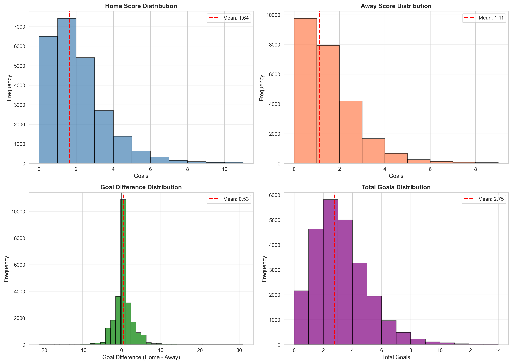
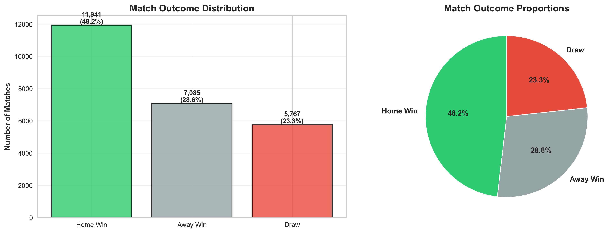
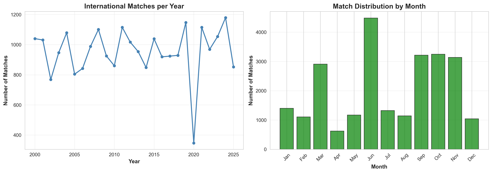
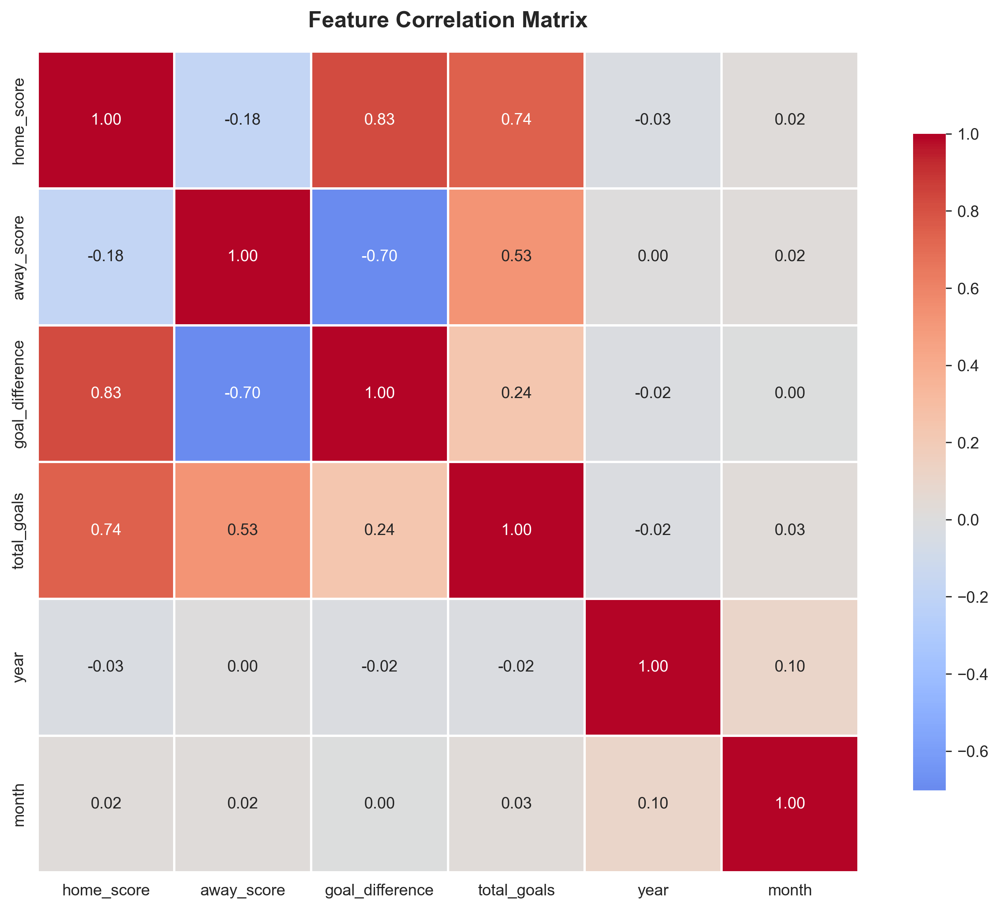

# Project Deliverable 1: Data Collection, Cleaning, and Exploration
---

## 📁 Repository Structure

```
MSCS_634_ProjectDeliverable_1/
│
├── project_deliverable_1.ipynb          # Main Jupyter notebook
├── README.md                       # Project documentation
├── football_cleaned_data.csv       # Cleaned dataset (generated)
├── score_distributions.png         # Score visualizations
├── match_outcomes.png              # Outcome analysis
├── temporal_trends.png             # Temporal patterns
└── correlation_matrix.png          # Feature correlations
```

---

## 🔗 Repository Link

**GitHub:** [MSCS_634_ProjectDeliverable_1](https://github.com/Su5ubedi/MSCS_634_ProjectDeliverable_1)

---

## 📊 Dataset Summary

**Dataset:** International Football Results (2000-2025)
**Source:** [GitHub - martj42/international_results](https://github.com/martj42/international_results)

| Metric | Value |
|--------|-------|
| Original Size | 48,850 matches (1872-2025) |
| Cleaned Size | 24,793 matches (2000-2025) |
| Features | 15 (9 original + 6 engineered) |
| Date Range | 2000-01-04 to 2025-11-19 |
| Missing Values | 0 |
| Duplicates | 0 |

**Original Features:** date, home_team, away_team, home_score, away_score, tournament, city, country, neutral

**Engineered Features:** goal_difference, total_goals, year, month, day_of_week, match_result

---

## 🔍 Key Insights from Analysis

### 1. Home Advantage Exists
- **Home wins:** 48.2% (11,941 matches)
- **Away wins:** 28.6% (7,085 matches)
- **Draws:** 23.3% (5,767 matches)
- **Average goal difference:** +0.53 (favoring home team)
- **Insight:** Home teams win 68% more often than away teams

### 2. Scoring Patterns
- **Average home goals:** 1.64 per match
- **Average away goals:** 1.11 per match
- **Average total goals:** 2.75 per match
- **Most common scoreline:** 1-0 (home win)
- **Distribution:** Right-skewed (more low-scoring matches)

### 3. Temporal Patterns
- **Peak months:** June, September, October (FIFA international windows)
- **Low months:** April, December (club season priority)
- **Peak year:** 2024 with 1,179 matches
- **COVID impact:** Sharp dip to 340 matches in 2020

### 4. Strong Correlations
- home_score ↔ goal_difference: **+0.83**
- away_score ↔ goal_difference: **-0.70**
- home_score ↔ total_goals: **+0.74**
- Temporal features show weak linear correlations

---

## 🔧 Major Steps in Data Cleaning and Exploration

### Data Cleaning Process

| Step | Action | Rows Removed | Remaining |
|------|--------|--------------|-----------|
| 1. Load data | Read from GitHub URL | - | 48,850 |
| 2. Handle missing | Removed 1 row with NaN | 1 | 48,849 |
| 3. Remove duplicates | No duplicates found | 0 | 48,849 |
| 4. Convert date | String → datetime | 0 | 48,849 |
| 5. Filter years | Keep 2000-2025 only | 24,056 | 24,793 |
| 6. Engineer features | Created 6 new columns | 0 | 24,793 |

**Rationale for filtering to 2000-2025:**
- Focus on modern football (consistent rules, tactics)
- More relevant for contemporary predictions
- Reduces historical heterogeneity
- Still maintains sufficient sample size (24,793 matches)

### Feature Engineering

1. **goal_difference** = home_score - away_score (regression target)
2. **total_goals** = home_score + away_score
3. **year** = extracted from date
4. **month** = extracted from date
5. **day_of_week** = extracted from date
6. **match_result** = categorical (Home Win/Draw/Away Win) for classification

### Exploratory Data Analysis

Generated 4 visualizations to understand data patterns:

#### 1. Score Distributions


Four-panel histogram showing:
- Home score distribution (mean: 1.64, right-skewed)
- Away score distribution (mean: 1.11, right-skewed)
- Goal difference distribution (mean: +0.53, home advantage visible)
- Total goals distribution (mean: 2.75, modal value: 2-3 goals)

#### 2. Match Outcomes


Bar chart and pie chart revealing:
- 48.2% home wins vs 28.6% away wins (clear home advantage)
- 23.3% draws (approximately 1 in 4 matches)
- Green/gray/red color scheme for win/draw/loss

#### 3. Temporal Trends


Line and bar charts showing:
- Yearly trend: steady increase 2000-2019, COVID dip in 2020, recovery by 2024
- Monthly pattern: peak in June/Sep/Oct (FIFA windows), low in Apr/Dec (club season)

#### 4. Correlation Matrix


Heatmap identifying:
- Strong positive correlation: home_score ↔ goal_difference (+0.83)
- Strong negative correlation: away_score ↔ goal_difference (-0.70)
- Weak temporal correlations suggesting non-linear relationships

---

## ⚠️ Challenges Encountered

### Challenge 1: Historical Data Heterogeneity
**Issue:** Dataset spans 153 years (1872-2025) with different rules, tactics, and competition standards across eras. Mixing amateur-era matches (1800s) with modern professional football creates heterogeneous data unsuitable for unified modeling.

**Solution:** Filtered to 2000-2025 to focus on modern football. Removed 24,056 historical matches (49.2%) but retained sufficient sample size (24,793) with consistent characteristics.

**Impact:** Improved data quality and relevance for contemporary predictions while maintaining statistical power.

---

### Challenge 2: Legitimate Outliers vs Data Errors
**Issue:** Extreme scores detected (31-0, 30-0, 24-0). Initial uncertainty whether these were data entry errors or legitimate matches.

**Investigation:**
- Verified matches in official FIFA records ✓
- Confirmed tournament context (World Cup qualification mismatches) ✓
- Example: Australia 31-0 American Samoa (2001) - newly formed amateur team vs professionals

**Decision:** **Retained all outliers** because:
- Matches actually occurred and are verified
- Removing would bias models against predicting lopsided matches
- Represent real football outcomes (<0.04% of data)
- Models should handle full range of possibilities